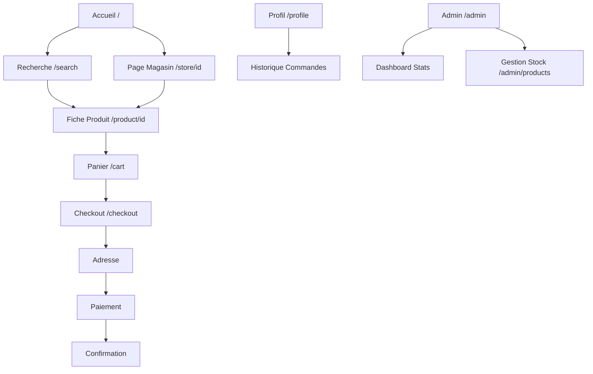

# Cahier des Charges Fonctionnel & Documentation - MesAchats241

Ce document constitue la référence officielle pour la plateforme **MesAchats241** (anciennement Mes Courses Faciles). Il combine les spécifications du cahier des charges et l'état d'avancement technique actuel.

---

## 1. Présentation Générale du Projet

### 1.1 Contexte et Problématique
Le marché de la distribution à Libreville, Gabon, manque d'une vitrine digitale unifiée. Les consommateurs font face à une absence de plateforme centralisée, une difficulté de comparaison des prix et un manque de solutions de paiement local (Mobile Money).

### 1.2 La Solution : MesAchats241
Une marketplace B2C multi-magasins centralisant les produits alimentaires et de nettoyage.
- **Périmètre (V1)** : Gestion magasins/produits, panier unique par magasin, paiement en ligne (Mobile Money, CB) et à la livraison, authentification sécurisée.

### 1.3 Objectifs
- **Fonctionnels** : Expérience d'achat fluide, gestion de catalogue par magasin, paiements adaptés (Airtel/Moov Money).
- **Techniques** : Architecture moderne (Next.js/React/Node.js), sécurité (JWT/Bcrypt), scalabilité.

---

## 2. Acteurs et Permissions

| Fonctionnalité | Administrateur (Admin) | Client |
| :--- | :---: | :---: |
| Gestion des magasins (CRUD) | ✅ | ❌ |
| Gestion des produits (CRUD) | ✅ | ❌ |
| Gestion des clients | ✅ | ❌ |
| Consultation du catalogue | ✅ | ✅ |
| Gestion du panier | ❌ | ✅ |
| Passage de commande | ❌ | ✅ |
| Paiement en ligne / Livraison | ❌ | ✅ |

---

## 3. Spécifications Fonctionnelles Détaillées

### 3.1 Authentification & Sécurité
- **Inscription/Connexion** : Validation stricte des données, hachage des mots de passe (BCrypt), gestion par tokens JWT avec expiration.
- **Rôles** : Redirection automatique (Admin vers Dashboard, Client vers Accueil).

### 3.2 Gestion des Magasins & Produits (Admin)
- **Magasins** : Création, modification, activation/désactivation des enseignes partenaires.
- **Produits** : Gestion complète du catalogue (Nom, prix en XAF, stock, images, unités) avec rattachement obligatoire à un magasin.

### 3.3 Catalogue & Recherche (Client)
- **Accueil** : Affichage des magasins et barre de recherche globale.
- **Navigation** : Filtres par catégories (Alimentaire, Nettoyage) et tri des produits.

### 3.4 Système de Panier
- **Règle métier** : Le panier est lié à un **magasin unique**. Le client ne peut pas mélanger des produits de magasins différents.
- **Actions** : Ajout, modification des quantités, suppression d'articles, calcul automatique TTC (incluant frais de livraison).

### 3.5 Modules de Paiement
| Mode | Description | État technique |
| :--- | :--- | :--- |
| **Airtel Money** | Paiement mobile local | API en attente d'intégration |
| **Moov Money** | Paiement mobile local | API en attente d'intégration |
| **Carte Bancaire** | Visa / Mastercard | Prévu via CinetPay/Stripe |
| **Espèces** | Paiement à la livraison | Manuel / Fonctionnel |

---

## 4. Navigation Schématique (Flux Next.js)

---

## 5. État d'Avancement Technique (Audit Mai 2026)

### ✅ Opérationnel (100%)
- **Socle Technique** : Next.js 15, React 19, Tailwind CSS 4, Prisma 6.
- **Auth & Sécurité** : API d'inscription/connexion avec BCrypt.
- **UX/UI** : Interfaces modernes, responsives et prêtes pour le mobile.
- **Logique Panier** : Implémentée via Context API avec persistance LocalStorage.

### 🛠 En cours de développement (Action requis)
- **Dynamisation** : Connexion des composants (Boutique, Recherche) aux données Prisma réelles.
- **Paiements Mobiles** : Intégration des APIs Airtel/Moov Money (CinetPay).
- **Admin CRUD** : Finalisation des formulaires de gestion produits/magasins pour l'administrateur central.
- **Finalisation Commandes** : Enregistrement effectif des commandes en base de données lors du checkout.
