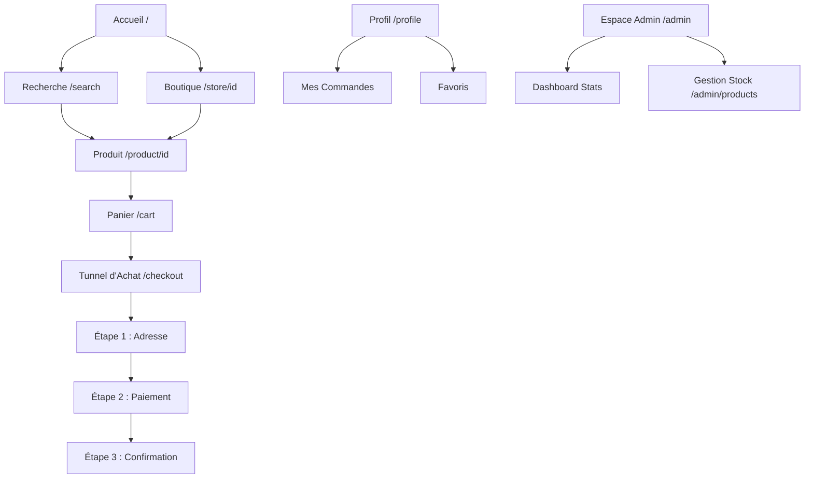

# Documentation Fonctionnelle - Mes Courses Faciles

Ce document présente un récapitulatif global des fonctionnalités, de la navigation et de l'état technique de l'application "Mes Courses Faciles" suite à sa refonte vers Next.js 15.

---

## 1. Améliorations majeures (Next.js 15+ vs Legacy)

| Aspect | Version Précédente (Legacy) | Nouvelle Version (Refonte) |
| :--- | :--- | :--- |
| **Sécurité** | Mots de passe en clair, vulnérabilité aux injections SQL. | Hachage BCrypt, requêtes sécurisées via Prisma ORM. |
| **Performance** | Chargement lourd, images non optimisées. | React Server Components (RSC), optimisation Next/Image. |
| **Interface** | Design HTML basique, non-responsive. | Mobile-first, Tailwind CSS 4, animations fluides. |
| **Multi-magasins** | Menu déroulant statique sans logique. | Architecture dédiée (Store ID) et filtrage réel. |
| **Expérience** | Rechargement de page à chaque action. | Navigation instantanée (SPA), gestion du panier en temps réel. |

---

## 2. Navigation et Structure de l'Application

### Schéma de Navigation

---

## 3. Inventaire des Workflows Utilisateurs

### A. Parcours d'Achat (Client)
1. **Découverte** : Sélection d'un magasin partenaire depuis l'accueil ou recherche globale d'un produit.
2. **Sélection** : Navigation par catégories dans la boutique choisie et ajout de produits au panier avec gestion des quantités.
3. **Paiement** : Tunnel de commande simplifié permettant de renseigner l'adresse de livraison et de choisir entre Airtel Money, Moov Money ou le paiement en espèces à la livraison.
4. **Suivi** : Consultation de l'historique des commandes et du profil utilisateur.

### B. Parcours d'Administration
1. **Pilotage** : Visualisation des performances de vente quotidiennes via le dashboard.
2. **Maintenance** : Mise à jour des produits et des niveaux de stock par magasin (Interface dédiée).

---

## 4. État des Fonctionnalités

### ✅ Fonctionnalités Opérationnelles
- **Authentification** : Système complet d'inscription et de connexion sécurisé.
- **Gestion du Panier** : Context API React pour un panier persistant et réactif.
- **Base de Données** : Schéma relationnel Prisma opérationnel (Stores, Products, Orders, Users).
- **Interface Utilisateur** : Design responsive prêt pour une utilisation mobile intensive.

### 🛠 Travaux Restants (Roadmap)
- **Dynamisation des Données** : Les pages Boutique, Recherche et Produit utilisent actuellement des données simulées. Il reste à connecter ces composants aux API existantes (`/api/products`).
- **Passerelle de Paiement** : Intégration technique de l'API de paiement mobile (ex: CinetPay) pour automatiser les transactions Airtel/Moov Money.
- **Back-office Product** : Finalisation des formulaires d'ajout et de modification de produits dans l'espace administrateur.
- **Validation Finale** : Liaison du bouton de validation du checkout à l'API de création de commande (`/api/orders`).

---

## 5. Liste des Interfaces
1.  **Accueil (`/`)** : Vitrine principale et choix du magasin.
2.  **Recherche (`/search`)** : Recherche multicritère et filtres.
3.  **Boutique (`/store/[id]`)** : Catalogue dynamique par magasin.
4.  **Détails Produit (`/product/[id]`)** : Informations complètes et ajout au panier.
5.  **Panier (`/cart`)** : Gestion des articles sélectionnés.
6.  **Checkout (`/checkout`)** : Processus de commande sécurisé.
7.  **Profil (`/profile`)** : Espace personnel utilisateur.
8.  **Dashboard Admin (`/admin`)** : Statistiques et monitoring.
9.  **Gestion Produits (`/admin/products`)** : Interface de contrôle du stock.
