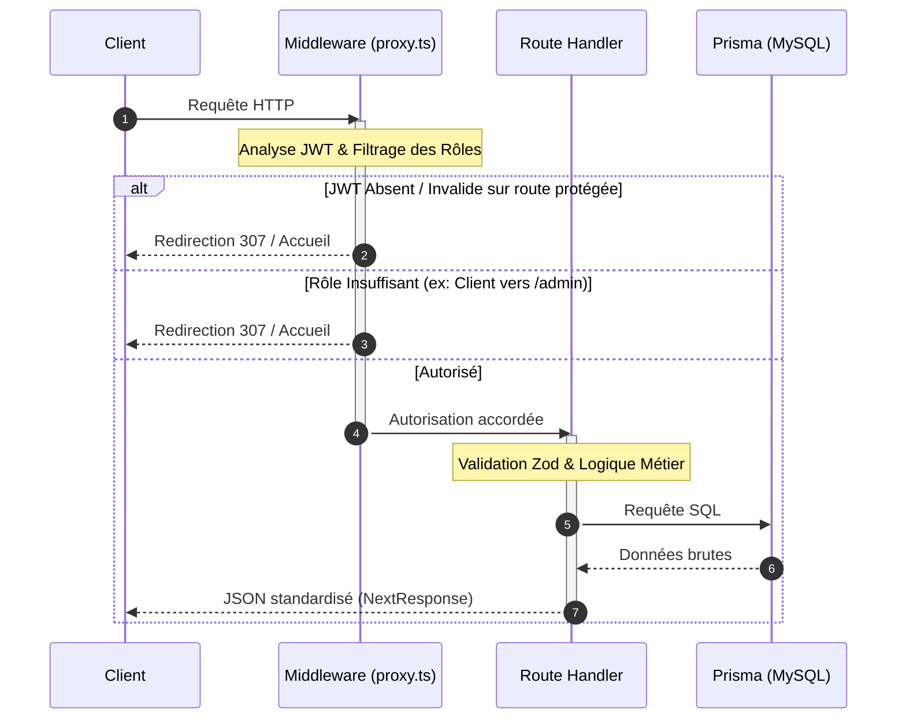

# Spécifications & Audit Technique Détaillé - Mes Courses Faciles

Ce document constitue la bible technique officielle et exhaustive de l'application **Mes Courses Faciles**. Il fournit une analyse chirurgicale, composant par composant, fichier par fichier, de l'ensemble de l'architecture.

---

## 🎯 SECTION 1 : La Couche Core & Utilitaires (src/lib, src/types, src/context, src/hooks, src/data)

Cette section documente la couche logique de l'application, incluant la validation, les états partagés, les hooks personnalisés, les singletons et les scripts utilitaires.

---

### 1. Fichiers de Validation & de Test (src/lib/validations/)

#### A. Schémas de Validation : `schemas.ts`
*   **Utilité exacte :** Définit la structure de validation Zod pour sécuriser et uniformiser les payloads (données entrantes) dans les formulaires clients, les requêtes API et les Server Actions. Il agit comme un garde-fou contre les injections ou les données invalides.
*   **Flux Opérationnel (Inputs/Outputs) :**
    *   *Input :* Objet JavaScript brut (provenant de `request.json()`, `formData` ou de formulaires React).
    *   *Output :* Objet typé valide conforme à la structure requise, ou lève une exception `ZodError` contenant la liste des erreurs par champ.
*   **Dépendances de la Stack :** Bibliothèque `zod`.
*   **Champs & Règles de Sécurité :**
    *   `userSchema` : Valide l'inscription. Exige un nom de min. 2 caractères, un e-mail valide, un téléphone au format international ou local, et un mot de passe d'au moins 8 caractères contenant au moins une majuscule (`regex(/[A-Z]/)`) et un chiffre (`regex(/[0-9]/)`).
    *   `loginSchema` : E-mail requis et mot de passe d'au moins 1 caractère.
    *   `storeSchema` : Nom (min. 2), adresse (min. 5), quartier (min. 2), téléphone valide, et logo (URL ou chaîne vide).
    *   `productSchema` : Nom (min. 2), catégorie, unité, magasin (`storeId`), prix (nombre positif converti dynamiquement via `z.coerce.number()`), et stock (entier non négatif via `z.coerce.number().int().nonnegative()`).
    *   `checkoutFormSchema` : Nom (min. 2), téléphone (min. 8), quartier (min. 2), moyen de paiement parmi `['airtel', 'moov', 'cash', 'card']`.
    *   `orderSchema` : Structure complète de commande avec vérification des lignes du panier (`items`) qui doivent contenir des prix et des quantités strictement positifs.

#### B. Tests des Schémas : `schemas.test.ts`
*   **Utilité exacte :** Garantit la pérennité et la non-régression des règles de validation Zod via des tests unitaires exécutés automatiquement lors de l'intégration continue.
*   **Flux Opérationnel (Inputs/Outputs) :**
    *   *Input :* Jeux de données de test (valides et invalides).
    *   *Output :* Succès du test si `userSchema.parse` réussit pour les cas valides et si `safeParse().success` renvoie `false` pour les cas invalides (mots de passe trop courts, prix négatifs, etc.).
*   **Dépendances de la Stack :** Test runner `vitest`.

---

### 2. Gestion des Statuts (src/lib/constants/)

#### A. Configurations de Statut : `order-statuses.ts`
*   **Utilité exacte :** Fichier de configuration centralisant le cycle de vie d'une commande. Il évite la duplication des libellés et des classes CSS de rendu visuel pour chaque statut en faisant office de "Single Source of Truth".
*   **Flux Opérationnel (Inputs/Outputs) :**
    *   *Input :* Statut de commande brut (`OrderStatus` de Prisma : `PENDING`, `PAID`, `SHIPPED`, `DELIVERED`, `CANCELLED`).
    *   *Output :* Objet de configuration `OrderStatusConfig` contenant :
        *   `adminLabel` : Libellé destiné aux gestionnaires (ex: "En préparation").
        *   `clientLabel` : Libellé destiné à l'acheteur (ex: "Validée").
        *   `badgeStyle` : Liste des classes Tailwind CSS de couleur et de bordure pour les badges.
        *   `stepperIndex` : Position numérique dans l'indicateur de suivi actif (1, 2, 3) ou `null` si la commande est terminée/annulée.
        *   `description` : Texte explicatif de l'étape.
*   **Dépendances de la Stack :** Types Prisma (`OrderStatus`).

---

### 3. Fichiers Plats Utilitaires (src/lib/)

#### A. Standardisation des Réponses : `api-response.ts`
*   **Utilité exacte :** Fournit un wrapper global pour les réponses HTTP des API Routes. Il force une structure de réponse unifiée facilitant la capture d'erreurs par le client.
*   **Flux Opérationnel (Inputs/Outputs) :**
    *   *Input :* Données à renvoyer (`data`), message d'erreur (`message`), code d'état HTTP, ou détails de débogage.
    *   *Output :* Instance de `NextResponse` sérialisée en JSON avec la structure : `{ success: boolean, data?: T, error?: string, details?: any }`.
*   **Méthodes statiques exposées :**
    *   `AppResponse.success(data, status)` : Renvoie un succès (Défaut : `200`).
    *   `AppResponse.error(message, status, details)` : Renvoie une erreur personnalisée (Défaut : `400`).
    *   `AppResponse.unauthorized()` : Raccourci pour code `401`.
    *   `AppResponse.forbidden()` : Raccourci pour code `403`.
    *   `AppResponse.notFound()` : Raccourci pour code `404`.
    *   `AppResponse.serverError(msg, details)` : Raccourci pour code `500`.
    *   `AppResponse.dbUnavailable()` : Raccourci pour code `503`.

#### B. Gardien d'Accès : `auth-guard.ts`
*   **Utilité exacte :** Encapsule la logique d'autorisation côté serveur pour bloquer l'exécution des Server Actions si l'utilisateur ne dispose pas d'une session valide ou du rôle requis.
*   **Flux Opérationnel (Inputs/Outputs) :**
    *   *Input :* Analyse des cookies de la requête en cours via `cookies()`.
    *   *Output :* Renvoie un objet `AuthSession` `{ id, email, name, role }` s'il est valide, sinon lève une exception `AuthError` (avec code `401` pour non connecté et `403` pour rôle insuffisant).
*   **Dépendances de la Stack :** API Next.js `next/headers`, utilitaire `verifyJWT` de `jwt.ts`.

#### C. Configuration Cloudinary : `cloudinary.ts`
*   **Utilité exacte :** Initialise le kit de développement (SDK) Cloudinary avec les identifiants de sécurité de l'environnement pour permettre les téléversements d'images.
*   **Flux Opérationnel (Inputs/Outputs) :**
    *   *Input :* Variables d'environnement `CLOUDINARY_CLOUD_NAME`, `CLOUDINARY_API_KEY`, `CLOUDINARY_API_SECRET`.
    *   *Output :* Instance configurée du client v2 de `cloudinary` prête à exécuter des uploads ou des streams de médias.
*   **Dépendances de la Stack :** Bibliothèque `cloudinary`.

#### D. Résolveur d'Images : `image-resolver.ts`
*   **Utilité exacte :** Gère la cascade de secours (fallbacks) pour les URLs d'images de produits et de magasins, et détecte si un fichier est local pour contourner l'optimisation des SVG.
*   **Flux Opérationnel (Inputs/Outputs) :**
    *   *Input :* Une URL/chemin brut issu de Prisma (pouvant être `null`, une chaîne JSON stringifiée de tableau d'images ou un chemin relatif) et un type (`store`, `product`, `avatar`).
    *   *Output :* Une URL de chaîne de caractères résolue et nettoyée, ou le chemin du placeholder SVG local (ex: `/images/product-placeholder.svg`) si la source est vide.
*   **Dépendances de la Stack :** Aucune (pur TypeScript).

#### E. Service JWT : `jwt.ts`
*   **Utilité exacte :** Assure la signature et le déchiffrement des jetons d'authentification de session.
*   **Flux Opérationnel (Inputs/Outputs) :**
    *   *Input (signJWT) :* Objet payload utilisateur (`JWTPayload`) et durée de validité (Défaut : `'7d'`).
    *   *Output (signJWT) :* Chaîne JWT chiffrée.
    *   *Input (verifyJWT) :* Chaîne JWT.
    *   *Output (verifyJWT) :* Payload décodé ou `null` si le jeton est altéré ou expiré.
*   **Dépendances de la Stack :** Bibliothèque `jose`.

#### F. Envoi de Courriels : `mail.ts`
*   **Utilité exacte :** Initialise le client de messagerie transactionnelle Resend et exporte les variables globales associées (adresse d'expédition et URL de l'application).
*   **Flux Opérationnel (Inputs/Outputs) :**
    *   *Input :* Variable d'environnement `RESEND_API_KEY`.
    *   *Output :* Instance de `Resend` configurée.
*   **Dépendances de la Stack :** Bibliothèque `resend`.

#### G. Singleton Prisma : `prisma.ts`
*   **Utilité exacte :** Initialise et exporte une instance unique de `PrismaClient` (Singleton). En mode développement, il attache l'instance à `globalThis` pour éviter d'ouvrir de nouvelles connexions à la base de données MySQL lors des rechargements de modules (Hot Module Replacement) induits par Next.js, ce qui saturerait le serveur de base de données.
*   **Flux Opérationnel (Inputs/Outputs) :**
    *   *Input :* Variable d'environnement `DATABASE_URL`.
    *   *Output :* Instance active globale de `PrismaClient`.
*   **Dépendances de la Stack :** `@prisma/client`.

#### H. Nettoyeur RSC : `serialization.ts`
*   **Utilité exacte :** Résout le bug Next.js de sérialisation des frontières Server-Client (RSC Boundary). Prisma renvoyant des objets contenant des types complexes (instances de `Date`, instances de `Decimal` ou de `Buffer`), le passage de ces objets à des composants clients (`use client`) provoque des plantages. Ce script convertit ces types en types primitifs JSON purs.
*   **Flux Opérationnel (Inputs/Outputs) :**
    *   *Input :* Objet complexe ou tableau retourné par Prisma.
    *   *Output :* Objet JSON pur équivalent, où les `Date` sont des chaînes ISO-8601, les `BigInt` sont castés en `Number`, et les `Buffer` sont convertis en chaînes Base64.
*   **Dépendances de la Stack :** Aucune (récursion pure).

#### I. Fusionneur de Classes : `utils.ts`
*   **Utilité exacte :** Utilitaire combinant le regroupement conditionnel de classes et la résolution de conflits d'héritage de classes Tailwind.
*   **Flux Opérationnel (Inputs/Outputs) :**
    *   *Input :* Liste d'arguments de classes (chaînes, objets conditionnels, tableaux).
    *   *Output :* Chaîne de caractères fusionnée nettoyée de tout doublon Tailwind.
*   **Dépendances de la Stack :** `clsx`, `tailwind-merge`.

---

### 4. Typages Globaux (src/types/)

#### A. Spécifications du Domaine : `index.ts`
*   **Utilité exacte :** Regroupe l'ensemble des définitions d'interfaces TypeScript représentant le modèle métier de l'application (`User`, `Store`, `Product`, `Order`, `OrderItem`, `SessionUser`), assurant la cohérence du typage du backend au frontend.
*   **Dépendances de la Stack :** Stricte correspondance avec les modèles générés de Prisma.

#### B. Typages PWA : `next-pwa.d.ts`
*   **Utilité exacte :** Déclare les signatures de modules manquantes pour la bibliothèque `next-pwa` afin de valider la compilation TypeScript lors de l'intégration de la PWA dans la configuration Next.js.

---

### 5. Contextes Globaux (src/context/)

#### A. État d'Authentification : `AuthContext.tsx`
*   **Utilité exacte :** Partage et maintient l'état de l'utilisateur connecté sur l'ensemble de l'arbre de composants client, tout en synchronisant les données de session locales avec le stockage du navigateur.
*   **Flux Opérationnel (Inputs/Outputs) :**
    *   *Input :* Cookie `mcf_jwt_session` (géré par le navigateur) et entrée du `localStorage` `mcf_user_data`.
    *   *Output (Expose) :* `{ user: User | null, login(userData), logout(), isAuthenticated: boolean, isLoading: boolean }`.
*   **Gestion des Effets & Optimisations :**
    *   Au montage du composant, récupère l'utilisateur depuis le `localStorage` pour éviter tout clignotement de l'interface (hydratation immédiate).
    *   La déconnexion vide à la fois l'état React, les clés du `localStorage` (`mcf_user_data`, `mcf_cart`), appelle la Server Action `logoutAction` pour détruire le cookie de session HTTP-Only, puis redirige vers l'accueil.

#### B. État du Panier : `CartContext.tsx`
*   **Utilité exacte :** Gère le panier de l'utilisateur (ajouts, suppressions, incrémentations de quantité), résout les conflits multiboutiques, et synchronise le panier avec la base de données.
*   **Flux Opérationnel (Inputs/Outputs) :**
    *   *Output (Expose) :* `{ cart: CartItem[], addToCart(product), removeFromCart(id), updateQuantity(id, qty), clearCart(), totalItems, totalPrice, deliveryFee }`.
*   **Logique de Persistance & Synchronisation (Anti-Boucle) :**
    *   *Utilisateur Invité (Guest) :* Le panier est stocké et lu directement depuis le `localStorage` sous la clé `mcf_cart`.
    *   *Utilisateur Connecté :* Un effet charge le panier depuis le serveur via `fetchUserCartAction()` au démarrage. Les modifications locales (ajouts, modifications) déclenchent automatiquement un appel à `syncCartAction(cart)` en arrière-plan.
    *   **Prévention des boucles infinies :** Utilise deux références `isInitialMount` (bloque la synchronisation serveur au chargement de l'application) et `isSyncingFromServer` (bloque l'effet d'écriture lorsque le panier vient tout juste d'être récupéré depuis le serveur).
    *   **Gestion Multiboutique :** Si le produit ajouté possède un `storeId` différent des articles actuellement présents dans le panier, l'état React bloque l'insertion, ouvre une boîte de dialogue modal Shadcn (`AlertDialog`), et demande confirmation pour vider le panier existant.

#### C. Notifications Éphémères : `ToastContext.tsx`
*   **Utilité exacte :** Gère l'affichage de notifications d'informations, de succès ou d'erreurs empilées en bas à droite de l'écran.
*   **Flux Opérationnel (Inputs/Outputs) :**
    *   *Output (Expose) :* `{ toast: { success(msg), error(msg), info(msg) } }`.
*   **Mécanismes d'Optimisation :**
    *   L'insertion génère un identifiant aléatoire par notification et planifie sa suppression automatique après 4 secondes via un `setTimeout`.
    *   Les callbacks de toast sont stabilisés avec `useMemo` et `useCallback` pour éviter de provoquer des re-renders chez les composants enfants consommateurs du hook `useToast`.

---

### 6. Hooks Personnalisés (src/hooks/)

#### A. Gestionnaire de Requêtes : `useApi.ts`
*   **Utilité exacte :** Abstraits la logique redondante de requêtes HTTP `fetch` côté client (gestion des états de chargement `loading` et d'erreur `error`).
*   **Flux Opérationnel (Inputs/Outputs) :**
    *   *Input :* Une URL cible et des options de requête (`FetchOptions` héritant de `RequestInit`).
    *   *Output :* `{ request(url, options), loading: boolean, error: string | null, setError }`.
*   **Logique de Requête :**
    *   Si le corps de la requête (`body`) est un objet classique (et non une instance de `FormData`), le hook injecte automatiquement l'en-tête `'Content-Type': 'application/json'` et sérialise le corps avec `JSON.stringify`.
    *   Il intercepte les réponses non-OK (`!res.ok`), parse le corps JSON pour y extraire le message d'erreur d'API standardisé, et lève une exception native pour le composant appelant.

#### B. Gestion des Favoris : `useFavorites.ts`
*   **Utilité exacte :** Fournit une couche d'abstraction pour enregistrer localement des articles coups de cœur dans le stockage persistant du navigateur.
*   **Flux Opérationnel (Inputs/Outputs) :**
    *   *Output :* `{ favorites: FavoriteProduct[], isFavorite(id), toggleFavorite(product), isLoaded: boolean }`.
*   **Logique Opérationnelle :**
    *   Initialise l'état au montage depuis la clé `mcf_favorites` du `localStorage`.
    *   `toggleFavorite` vérifie si l'article est déjà présent. Si oui, il est filtré et retiré. Si non, il est ajouté à la liste. La nouvelle liste est sérialisée et enregistrée dans le `localStorage`.

---

### 7. Gestion de Données & Scripts de Qualité (src/data/)

#### A. Configuration de Plateforme : `preferences.json`
*   **Utilité exacte :** Fichier de configuration plat contenant les paramètres configurables de la plateforme (nom, frais de livraison par défaut, mode maintenance, activation des notifications, contact). Il est lu par le serveur et modifié via le panneau d'administration.

#### B. Audit Anti-Popups : `search_popups.py`
*   **Utilité exacte :** Script d'assurance qualité écrit en Python. Il parcourt récursivement le code source du projet pour y rechercher des appels aux méthodes natives et bloquantes du navigateur (`alert()` et `confirm()`) qui dégradent l'expérience utilisateur premium et bloquent les outils de test automatique.
*   **Flux Opérationnel :**
    *   *Input :* Analyse des fichiers de développement `.ts`, `.tsx`, `.js`, `.jsx` du dossier `src/`.
    *   *Output :* Affiche dans le terminal la liste des lignes de code contenant des popups natives (hors commentaires).

#### C. Traçabilité des Schémas : `search_schema.py`
*   **Utilité exacte :** Script de débogage Python recherchant l'ensemble des fichiers faisant référence au schéma Zod `productSchema`, permettant de s'assurer de l'exhaustivité des validations de produits sur le projet.

---

## 🎯 SECTION 2 : Architecture d'API REST & Routage (src/app/api/)

Chaque route API Next.js est structurée sous forme de Route Handlers. Elles s'exécutent côté serveur et communiquent avec la base de données.

---

---

### 1. Alertes d'Administration : `api/admin/notifications/route.ts`
*   **Cycle de vie de la requête :**
    1.  **Vérification de la session :** Lit le cookie `mcf_jwt_session` et valide le rôle `ADMIN` via `verifyJWT`. Si invalide -> Réponse `401 Unauthorized` ou `403 Forbidden`.
    2.  **Collecte des événements MySQL (Prisma) :**
        *   Récupère les commandes au statut `PENDING` (sélectionne uniquement le nom du client pour des raisons de moindre privilège).
        *   Récupère les produits actifs en rupture de stock (`stock === 0`).
    3.  **Synchronisation de la table `Notification` :**
        *   Construit une clé de référence pour chaque événement (`order-[id]` ou `product-[id]`).
        *   Compare ces références avec les notifications existantes en base de données. Insère les nouvelles notifications non lues.
        *   **Résolution automatique (Auto-Read) :** Si une notification est stockée comme "non lue" en BDD mais que son événement n'est plus actif (ex: la commande en attente a été traitée ou le stock a été réapprovisionné), elle est mise à jour automatiquement en `isRead: true`.
    4.  **Retour :** Renvoie la liste complète des notifications et le flag `hasUnread` au format JSON.

### 2. Authentification : `api/auth/login/route.ts` & `api/auth/register/route.ts`
*   **Cycle de vie de la requête (Login) :**
    1.  **Parsing & Validation :** Lit le corps JSON et valide les champs via `loginSchema.parse(body)`. En cas d'erreur, retourne un code `400 Bad Request` avec les erreurs formatées par Zod.
    2.  **Vérification des Identifiants :** Recherche l'utilisateur par e-mail dans la table `User`. Si introuvable -> retourne un code `401 Unauthorized` ("Identifiants invalides").
    3.  **Comparaison Hash Bcrypt :** Compare le mot de passe fourni avec le mot de passe chiffré en BDD via `bcrypt.compare`. Si non concordant -> Retourne un code `401`.
    4.  **Vérification Statut :** Valide si le compte est actif (`isActive === true`). Si suspendu -> Retourne un code `403 Forbidden`.
    5.  **Signature du Token :** Signe un jeton JWT contenant `{ id, email, name, role }` via `jose`.
    6.  **Établissement du Cookie de Session :** Injecte le jeton JWT dans un cookie HTTP-Only nommé `mcf_jwt_session` avec une durée de vie d'une semaine (`maxAge: 60 * 60 * 24 * 7`).
    7.  **Retour :** Renvoie l'objet utilisateur (sans le mot de passe) avec un code `200 OK`.
*   **Cycle de vie de la requête (Register) :**
    1.  Valide les entrées utilisateur via `userSchema.parse(body)`.
    2.  Vérifie l'unicité de l'e-mail dans la base de données. Si existant -> Code `400` ("User already exists").
    3.  Chiffre le mot de passe avec `bcrypt.hash(password, 10)`.
    4.  Crée l'enregistrement dans la table `User` avec le rôle `CLIENT` par défaut.
    5.  Émet le cookie de session JWT et retourne l'utilisateur créé avec un code `201 Created`.

### 3. Commandes & Magasins : `api/orders/route.ts` & `api/stores/route.ts`
*   **Cycle de vie de la requête (api/orders - GET & POST) :**
    *   **GET (Lecture des commandes utilisateur) :**
        1.  Lit la session depuis le cookie JWT. Si non connecté -> Retourne un code `401`.
        2.  Récupère les commandes via Prisma avec la contrainte stricte `where: { userId: session.id }`. Cela garantit qu'un client ne peut pas visualiser les commandes d'un autre client (protection anti-IDOR).
        3.  Retourne la liste des commandes avec un code `200`.
    *   **POST (Création de commande - Legacy) :**
        1.  Valide le JWT et extrait le `userId` du jeton.
        2.  Valide le payload entrant via `orderSchema.parse(body)`.
        3.  Effectue une insertion Prisma de la commande et crée de manière imbriquée (`create`) les lignes de commande `orderItems`.
        4.  Retourne la commande créée avec un code `201`.
*   **Cycle de vie de la requête (api/stores - GET) :**
    1.  Exécute une requête Prisma `findMany` pour récupérer les magasins actifs non supprimés (`isActive: true, isDeleted: false`).
    2.  Retourne la liste en JSON avec un code `200`. Aucune authentification requise.

### 4. Produits : `api/products/route.ts` & `api/products/[id]/route.ts`
*   **Cycle de vie de la requête (api/products - GET) :**
    1.  Lit les paramètres de requête de l'URL (`storeId`, `category`, recherche textuelle `q`).
    2.  Construit dynamiquement la clause `where` pour Prisma :
        *   Filtre uniquement les produits actifs (`isActive: true, isDeleted: false`).
        *   Si `storeId` ou `category` sont fournis, les ajoute à la clause.
        *   Si `q` est fourni, ajoute une condition de recherche insensitive à la casse sur les champs `name`, `description` ou `category` (via l'opérateur `OR` de Prisma).
    3.  Exécute `prisma.product.findMany` en incluant le nom du magasin associé.
    4.  Retourne le tableau de produits avec un code `200`.
*   **Cycle de vie de la requête (api/products/[id] - GET) :**
    1.  Extrait le paramètre dynamique `id` de l'URL.
    2.  Exécute `prisma.product.findUnique` avec `where: { id }`.
    3.  Si le produit est introuvable -> Retourne un code `404 Not Found`. Sinon, retourne l'objet produit avec un code `200`.

### 5. Recherche Prédictive : `api/search/suggestions/route.ts`
*   **Cycle de vie de la requête :**
    1.  Récupère le paramètre de recherche `q`.
    2.  **Garde-fou :** Si `q` est vide ou fait moins de 2 caractères, retourne immédiatement un objet `{ stores: [], products: [] }` (évite les requêtes SQL trop larges).
    3.  **Requêtes Parallèles MySQL :** Lance deux requêtes concurrentes via Prisma :
        *   Recherche les magasins actifs dont le nom contient `q` (limite le résultat à 3).
        *   Recherche les produits actifs dont le nom contient `q` (limite le résultat à 5, inclut le nom du magasin).
    4.  Retourne l'objet combiné avec un code `200`.

### 6. Téléversement d'Images : `api/upload/route.ts`
*   **Cycle de vie de la requête :**
    1.  **Vérification de sécurité :** Valide le JWT de session et s'assure que le rôle est strictement `ADMIN`. Si non -> Retourne un code `401` ou `403`.
    2.  **Extraction du fichier :** Récupère le `formData` et extrait le fichier binaire (`formData.get('file')`) et le dossier cible.
    3.  **Garantie anti-collision :** Nettoie le nom de fichier d'origine en remplaçant les caractères spéciaux par des underscores, puis génère un identifiant unique en y concaténant le timestamp courant et un UUID court (`crypto.randomUUID().substring(0, 8)`).
    4.  **Téléversement par flux (Stream) :** Convertit l'image en Buffer Node.js et l'envoie à l'API Cloudinary par streaming (`cloudinary.uploader.upload_stream`). Cette approche évite d'écrire des fichiers temporaires sur le disque du serveur, préservant la sécurité et l'espace de stockage.
    5.  **Retour :** Retourne l'URL Cloudinary de l'image téléversée (`secure_url`) avec un code `200`.

---

## 🎯 SECTION 3 : Les Composants Métier Front-End (src/components/blocks/)

Les composants métiers structurent l'expérience utilisateur. Ils intègrent la gestion des thèmes premium (glassmorphism) et les animations de transition.

---

### 1. Composants de la Page d'Accueil (`home/`)

#### A. Suivi de Commande : `ActiveOrderTracker.tsx`
*   **Style & Rendu :** Bordure lumineuse dégradée aux couleurs de la marque (`from-brand-primary/50 to-transparent`), fond flouté en verre acrylique (`bg-white/60 dark:bg-slate-900/50 backdrop-blur-xl`) et ombre portée diffuse.
*   **Animations :** L'icône de colis possède un effet pulsant permanent via une classe d'animation Ping et une opacité réduite (`animate-ping opacity-40`). La barre de progression utilise des transitions fluides CSS (`transition-all duration-700 ease-out`) pour s'ajuster lors des changements d'état.

#### B. Bannière Hero Interactive : `HeroContent.tsx`
*   **Style & Rendu :** Texte géant avec dégradé de couleur et effet de lueur doré (`text-glow-safran`).
*   **Animations & Effet Parallaxe 3D :**
    *   **Logique de rotation dynamique :** Le conteneur écoute les mouvements du pointeur via `onMouseMove`. Il calcule la position relative de la souris par rapport au centre de la carte et met à jour deux variables de mouvement de Framer Motion (`mouseX`, `mouseY`).
    *   Ces variables de mouvement sont mappées vers des angles de rotation via `useTransform` :
        *   Axe X : inclinaison de -10 à 10 degrés.
        *   Axe Y : inclinaison de -10 à 10 degrés.
    *   La scène utilise l'attribut CSS `transformStyle: "preserve-3d"` et une perspective de 1200px. Les éléments enfants flottent à différentes profondeurs (`translateZ(-30px)` pour le fond, `translateZ(40px)` pour le suivi de commande, `translateZ(90px)` pour la carte de paiement, et `translateZ(120px)` pour le badge de panier), créant un effet 3D immersif au survol de la souris.
    *   La carte de paiement et le badge de panier ont des animations de lévitation infinies (`animate={{ y: [0, 8, 0] }}`).

#### C. Bento Grid d'Explication : `HowItWorks.tsx`
*   **Style & Rendu :** Disposition asymétrique type "Bento Grid". Cartes en verre trempé sombre (`bg-slate-900/40 border-white/10 backdrop-blur-md`).
*   **Animations :** Utilise des animations d'apparition au défilement (Scroll Animations). Framer Motion applique un effet de décalage temporel (`staggerChildren: 0.2`) pour faire apparaître les étapes les unes après les autres.

#### D. Carrousel Promotionnel : `PromoCarousel.tsx`
*   **Style & Rendu :** Grand panneau d'affichage avec dégradé de noir en fondu sur l'image de fond pour assurer la lisibilité des textes blancs.
*   **Animations :** Transition d'images par fondu enchaîné (cross-fade) gérée par `AnimatePresence`. Le texte d'accueil s'anime verticalement lors du changement d'image (`initial={{ opacity: 0, y: 10 }}`). Les indicateurs circulaires en bas s'étirent dynamiquement (`w-8` au lieu de `w-2.5`) pour indiquer la diapositive active.

#### E. Avis Clients : `TestimonialsCarousel.tsx`
*   **Style & Rendu :** Cartes de témoignages avec profil d'utilisateurs et étoiles dorées.
*   **Animations :** Transition horizontale par glissement avec ressort (`type: "spring", stiffness: 100`) contrôlée par des flèches directionnelles de navigation.

#### F. Grille de Promesses : `WhyChooseUs.tsx`
*   **Style & Rendu (Spotlight Glare) :**
    *   **Mécanisme de survol lumineux :** Chaque carte écoute les mouvements du pointeur (`onMouseMove`). Le script calcule les coordonnées locales du curseur par rapport au rectangle de la carte et met à jour deux propriétés CSS personnalisées (`--mouse-x` et `--mouse-y`) sur l'élément DOM.
    *   Le fond de la carte applique un masque de gradient radial centré sur ces variables CSS (`radial-gradient(300px circle at var(--mouse-x) var(--mouse-y), rgba(255,255,255,0.05), transparent 80%)`). Cela crée un halo de lumière blanche très subtil qui suit le curseur de l'utilisateur.

---

### 2. Composants du Panier et du Tunnel d'Achat (`cart/`)

#### A. Tiroir de Commande : `CartDrawer.tsx`
*   **Style & Rendu :** Panneau latéral coulissant de droite avec listing vertical des articles, calcul des frais intermédiaires et bouton de validation.
*   **Animations :** Transition d'ouverture et de fermeture gérée par la feuille Shadcn (`SheetContent`). L'icône de panier d'achat utilise le hook `framer-motion` pour effectuer un sursaut d'échelle (`scale: [1, 1.3, 0.9, 1.1, 1]`) dès qu'un produit y est inséré.

#### B. Formulaire Checkout Client : `CheckoutClientForm.tsx`
*   **Style & Rendu :** Formulaire sur une colonne pour la saisie des informations de livraison, couplé à une grille de sélection visuelle pour les modes de paiement et à un résumé de commande latéral persistant.
*   **Animations :** Transition d'affichage lors de la validation finale du formulaire, remplaçant le formulaire de saisie par un écran de confirmation animé (`CheckCircle2` en fondu d'échelle).

#### C. Entonnoir Stepper : `CheckoutWizard.tsx`
*   **Style & Rendu :** Composant orchestrant la transition par étapes. Affiche en en-tête une barre de progression reliant les trois cercles d'étapes (Livraison, Paiement, Confirmation). La ligne de progression se remplit dynamiquement en fonction de l'étape courante.

#### D. Étape Livraison : `DeliveryStep.tsx`
*   **Style & Rendu :** Formulaire de saisie d'adresse. Les champs en erreur s'entourent d'une bordure rouge destructrice avec affichage du message de contrainte Zod.

#### E. Bouton de Panier Flottant : `FloatingCartButton.tsx`
*   **Style & Rendu :** Petit bouton circulaire positionné en bas à droite de l'écran (sur mobile), affichant un badge avec le nombre d'articles du panier.

#### F. Grille des Paiements : `PaymentMethodStep.tsx`
*   **Style & Rendu :** Grille présentant les options de paiement (Airtel, Moov, Carte, Cash). L'option sélectionnée s'active avec une bordure de couleur distinctive et fait apparaître une coche de validation dans l'angle supérieur.

---

### 3. Composants du Catalogue de Produits (`catalog/`)

#### A. Actions de Produit : `ProductActions.tsx`
*   **Style & Rendu :** Bloc comprenant le sélecteur de quantité numérique, le bouton principal d'ajout au panier et le raccourci vers la liste de favoris.
*   **Animations :** Le bouton d'ajout au panier transite d'un fond orange vers un fond vert émeraude au clic, affichant le texte "Ajouté !" et une icône de validation avec une animation d'entrée rapide. L'icône de cœur des favoris bat brièvement (`scale: 1.15`) lorsqu'elle passe à l'état actif (rouge rempli).

#### B. Vignette Produit : `ProductCard.tsx`
*   **Style & Rendu :** Carte produit avec fond translucide, bordure supérieure blanche à faible opacité (`border-white/10`) pour l'effet de brillance, et conteneur d'image à aspect carré.
*   **Animations :** Zoom progressif de l'image de 105% et légère translation verticale de la carte vers le haut (`hover:-translate-y-1`) lors du survol.

#### C. Galerie d'Images : `ProductGallery.tsx`
*   **Style & Rendu :** Affiche l'image principale du produit en grand format et une rangée de miniatures en dessous.
*   **Animations :** Fondu d'affichage lors du clic sur une miniature pour actualiser l'image principale.

#### D. Vignette Magasin : `StoreCard.tsx`
*   **Style & Rendu :** Présentation du magasin partenaire avec son logo, sa spécialité, son quartier et son temps de préparation estimé.
*   **Animations :** Agrandissement de l'image de fond et effet de surbrillance de la bordure extérieure au survol.

---

### 4. Composants d'Administration (`admin/`)

#### A. Clients de Tableaux de Données (Datatables)
*   **`AdminOrdersClient.tsx`** : Reçoit la liste des commandes. Intègre les colonnes de données (ID, Client, Montant, Date, Mode de paiement, Statut) et affiche le panneau `OrderDetailsSheet` au clic sur le bouton d'action "Gérer".
*   **`AdminProductsClient.tsx`** : Reçoit les produits et intègre le hook de mutation optimiste `useOptimistic` pour retirer visuellement de la liste un produit dès que l'administrateur confirme sa suppression, sans attendre le retour de la base de données.
*   **`AdminStoresClient.tsx`** : Gère la liste des magasins partenaires et permet de basculer l'état d'activité d'un magasin.
*   **`AdminUsersClient.tsx`** : Permet de visualiser les comptes clients de la plateforme et de suspendre/activer un compte.
*   **`AnalyticsClient.tsx`** : Reçoit les données de statistiques de vente agrégées en SQL et orchestre le rendu des graphiques interactifs (Recharts) de répartition sectorielle.
*   **`NotificationsClient.tsx`** : Affiche le flux des alertes d'administration (nouvelles commandes en attente et produits en rupture de stock).

#### B. Panneaux et Formulaires de Mutation (Slide-out Sheets)
*   **`ProductCreateSheet.tsx`** & **`ProductEditSheet.tsx`** : Panneaux coulissants de droite gérant la création et l'édition de produits. Intègrent la zone de Drag & Drop d'images qui envoie les fichiers à `/api/upload` et stocke les URLs Cloudinary dans un état local pour les soumettre ensuite à la Server Action.
*   **`StoreCreateSheet.tsx`** & **`StoreEditSheet.tsx`** : Formulaires de gestion des magasins avec intégration du logo et du quartier.
*   **`OrderDetailsSheet.tsx`** : Panneau affichant le détail complet d'une commande (produits achetés, quantités, prix d'achat historiques, adresse de livraison) et un sélecteur permettant à l'administrateur de faire transiter l'état de la commande (`OrderStatus`).
*   **`SettingsClient.tsx`** : Gère les configurations générales du profil de l'administrateur connecté et les préférences globales de la plateforme (frais de livraison, maintenance).

---

### 5. Composants de Recherche (`search/`)

#### A. Tableau de Bord Découverte : `DiscoveryBoard.tsx`
*   **Style & Rendu :** Structure les sections d'accueil client en deux colonnes de tendances.
*   **Animations :** Enveloppé dans un composant `<Suspense>` pour afficher des squelettes de chargement (`Skeletons`) grisés et animés en pulsation pendant la récupération des données.

#### B. Page de Recherche : `SearchContent.tsx`
*   **Style & Rendu :** Grand champ de saisie de recherche au style épuré, suivi par les vignettes de catégories populaires en dégradés colorés (Épicerie, Produits Frais, Boissons, Hygiène).
*   **Animations :** Transitions d'affichage gérées par `AnimatePresence` pour alterner entre le tableau de bord de découverte (lorsque le champ est vide) et la grille des résultats de recherche.

#### C. Saisie Semi-Automatique : `SearchSuggestionsInput.tsx`
*   **Style & Rendu :** Champ de recherche intelligent qui ouvre une modale de suggestions sous l'axe de saisie.
*   **Animations :** Affiche en temps réel des suggestions de magasins et de produits correspondants au fur et à mesure de la frappe de l'utilisateur, avec un indicateur de chargement rotatif (`Loader2` de Lucide).

---

### 6. Composants Profil et Commande Client (`client/`)

#### A. Historique et Profil : `ProfileClient.tsx`
*   **Style & Rendu :** Interface utilisateur comprenant des onglets latéraux (Mon Profil, Mes Commandes, Mes Favoris, Sécurité).
*   **Animations :** Transitions fluides lors du changement d'onglet.

#### B. Détail Commande Client : `OrderDetailsSheet.tsx`
*   **Style & Rendu :** Panneau de détails simplifié pour le client, affichant la facture finale et le statut d'avancement de sa commande.

---

## 🎯 SECTION 4 : Composants Communs, Structuraux & Configuration Racine

Cette section détaille les briques de structure globale de l'interface (Layouts, Barres de navigation, Squelettes de chargement) et les fichiers de configuration système de la racine.

---

### 1. Composants de Structure & de Mise en Page (`common/` & `layout/`)

#### A. Conteneur Global : `PageLayout.tsx`
*   **Utilité exacte :** Définit le conteneur principal de mise en page pour l'ensemble des pages de l'application, assurant un alignement et des marges horizontales uniformes sur tous les écrans.
*   **Flux Opérationnel (Inputs/Outputs) :**
    *   *Input (Props) :* `children: ReactNode`, `withPadding?: boolean` (Défaut : `true`).
    *   *Output :* Élément HTML `<main>` appliquant des styles de largeur maximale (`max-w-7xl mx-auto`) et des rembourrages adaptatifs.

#### B. En-tête de Page : `PageHeader.tsx`
*   **Utilité exacte :** Affiche le titre de la section courante avec une ligne de description et un espace optionnel pour des boutons d'actions contextuelles (ex: "Ajouter un produit").
*   **Flux Opérationnel (Inputs/Outputs) :**
    *   *Input (Props) :* `title: string`, `description?: string`, `children?: ReactNode` (actions).

#### C. Transition Animée : `PageWrapper.tsx`
*   **Utilité exacte :** Wrapper animant l'entrée d'une page pour éviter un affichage trop brusque du contenu lors du changement de route.
*   **Flux Opérationnel (Inputs/Outputs) :**
    *   *Input (Props) :* `children: ReactNode`, `className?: string`.
    *   *Output :* Composant `motion.div` de Framer Motion appliquant un fondu d'entrée (`opacity: [0, 1]`) et une légère translation verticale (`y: [10, 0]`).

#### D. Squelettes de Chargement : `Skeletons.tsx`
*   **Utilité exacte :** Exporte les composants de squelettes animés (`ProductSkeleton`, `StoreSkeleton`) utilisés comme états d'attente (fallbacks) dans les blocs `<Suspense>`.
*   **Flux Opérationnel (Inputs/Outputs) :**
    *   *Output :* Blocs HTML imitant la structure des cartes de produits/magasins avec une couleur grise de fond et une animation de pulsation (`animate-pulse`).

#### E. Barre de Navigation Supérieure : `Navbar.tsx` & `UserMenus.tsx`
*   **Utilité exacte :** Barre d'en-tête principale de l'application. Elle affiche le logo, la barre de recherche rapide, le raccourci vers le panier coulissant et le menu de l'utilisateur.
*   **Logique de cloisonnement des droits :**
    *   Le menu utilisateur inspecte le rôle de la session JWT.
    *   Si l'utilisateur est connecté avec le rôle `ADMIN`, le menu affiche un lien vers le panneau d'administration `/admin` et masque les contrôles spécifiques aux clients (suivi de panier, favoris client) pour éviter les incohérences d'état.
    *   Si l'utilisateur est connecté avec le rôle `CLIENT`, il affiche les liens vers le profil utilisateur `/profile`, l'historique des achats et la liste de favoris.

#### F. Barre Mobile Basse : `BottomTabBar.tsx`
*   **Utilité exacte :** Barre de navigation sticky en bas d'écran destinée aux smartphones, offrant des raccourcis vers l'accueil, la recherche, le panier et le profil.

#### G. Pied de Page : `Footer.tsx`
*   **Utilité exacte :** Affiche les informations de copyright de la plateforme, les liens légaux et les liens vers le support client.

---

### 2. Composants UI & Shadcn Configuration (src/components/ui/)

#### A. Rendu d'Images Anti-Casse : `ImageWithLoader.tsx`
*   **Utilité exacte :** Composant image universel qui sécurise l'affichage de tous les visuels du site. Il résout le bug majeur de Next.js qui rend les images SVG locales invisibles (hauteur à 0).
*   **Flux Opérationnel (Inputs/Outputs) :**
    *   *Input (Props) :* `src: string | null` (source brute de base de données), `alt: string`, `type: 'product' | 'store' | 'avatar'`, `objectFit?: 'cover' | 'contain'`.
    *   *Output :* Composant d'image sécurisé avec skeleton de chargement intégré.
*   **Algorithme de Sécurité & Résolution SVG :**
    1.  **Résolution initiale :** Appelle `resolveImageUrl(src, type)` pour garantir une URL toujours valide.
    2.  **Détection SVG local :** Si le chemin résolu se termine par `.svg` et pointe vers le dossier `/public`, le composant force les attributs de dimensions fixes `width={200}` et `height={200}` au lieu d'utiliser l'attribut `fill`. Cela contourne le pipeline d'optimisation Next.js qui ne peut pas calculer les dimensions intrinsèques des fichiers vectoriels locaux.
    3.  **Double protection sur erreur :** Si l'image distante échoue à charger (`onError`), le composant bascule sur le placeholder local SVG. Si même le placeholder local échoue à charger, il bascule sur un état d'erreur fatal qui affiche un composant CSS pur (icône Lucide du type d'image + texte alternatif), évitant tout affichage d'icône d'image brisée sur le site.

#### B. Configuration Shadcn : `components.json`
*   **Utilité exacte :** Fichier de configuration du framework Shadcn CLI. Il définit le répertoire cible des composants d'interface générés (`@/components/ui`), l'alias du fichier utilitaire de classes (`@/lib/utils`), et force l'activation du support des Server Components (`"rsc": true`).

---

### 3. Fichiers de Configuration Racine

#### A. Déploiement Netlify : `netlify.toml`
*   **Utilité exacte :** Pilote le pipeline d'intégration et de déploiement continu sur Netlify.
*   **Flux Opérationnel :**
    *   **Build Pipeline :** Avant de compiler le projet Next.js via `next build`, il exécute successivement `prisma db push` (synchronise le schéma de base de données avec l'instance de production TiDB Cloud) et `prisma generate` (régénère le client Prisma local avec les types de tables mis à jour).
    *   Spécifie que le répertoire de publication final est le dossier d'export `.next/` et configure le plug-in `@netlify/plugin-nextjs` pour gérer le rendu hybride (SSR/ISR) sur l'infrastructure serverless de Netlify.

#### B. Tests de Bout en Bout : `playwright.config.ts`
*   **Utilité exacte :** Configure l'environnement de test End-to-End (E2E) pour simuler des parcours utilisateurs complets sur différents navigateurs.
*   **Flux Opérationnel :**
    *   Configure un serveur local sur le port `3001` à l'aide de la commande `npx next start -p 3001`.
    *   Définit deux profils de test : un navigateur bureau Chrome (résolution 1920x1080) et un navigateur mobile Safari (émulant un iPhone 12) pour valider l'adaptabilité de l'interface.

#### C. Tests Unitaires : `vitest.config.ts` & `vitest.setup.ts`
*   **Utilité exacte :** Configurent l'environnement d'exécution des tests unitaires rapides du projet.
*   **Flux Opérationnel :**
    *   `vitest.config.ts` : Active le plug-in React, définit l'environnement de test sur `jsdom` (moteur de rendu de DOM virtuel en mémoire), configure les alias de dossiers (`@/` vers `/src`) et exclut les répertoires de tests E2E.
    *   `vitest.setup.ts` : Importe `@testing-library/jest-dom` pour ajouter des assertions personnalisées sur les éléments HTML testés.

#### D. Catalogue d'Images Premium : `images-assets-config.json`
*   **Utilité exacte :** Fichier faisant office de source de vérité pour le catalogue de démonstration. Il contient les prompts textuels de génération d'images et les URLs de visuels haute définition issus d'Unsplash pour chaque magasin et chaque produit. Ce fichier est lu par le script d'initialisation de la base de données (Seeding) pour s'assurer que la plateforme présente des visuels professionnels sans recourir à des placeholders de basse qualité.
